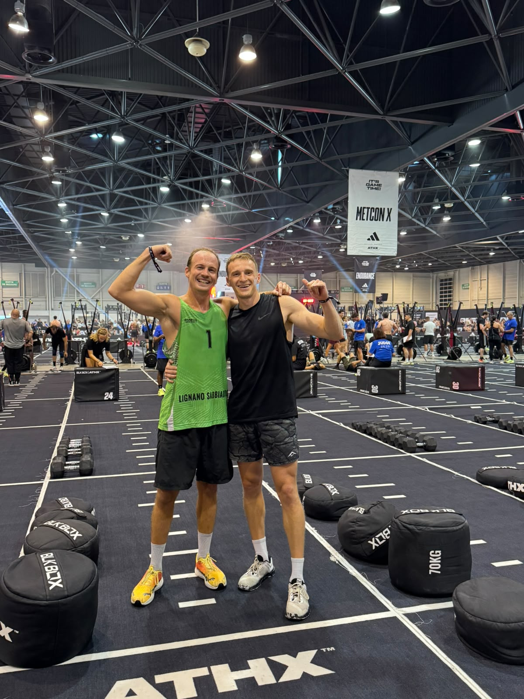
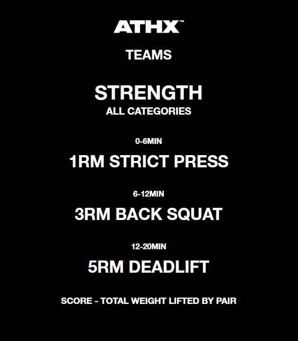
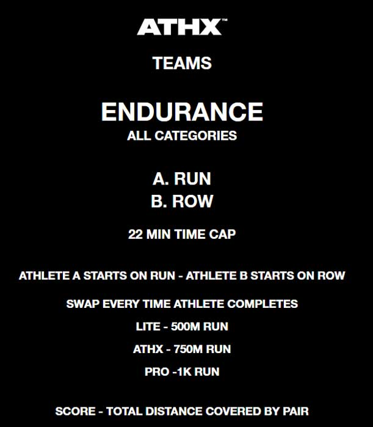
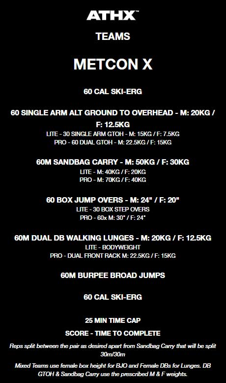

  

# 🏋️‍♂️ ATHX Performance Analytics & Race Simulator

## 📌 Personal Background & Motivation

After spending 10 years working on major construction sites, I decided to take a sabbatical year to challenge myself both personally and professionally. One of my primary goals was to rebuild my physical fitness, which had taken a back seat during my intense work routine. 

Having always been an active sports enthusiast (beach volleyball, rock climbing, surfing, tennis), I wanted to test my limits with a completely new discipline. In **February 2026**, I began a structured training program targeting the **ATHX Competition in September 2026**—an intense, ~2.5-hour hybrid fitness event combining maximal strength, cardiovascular endurance, and metabolic conditioning.

As a data-driven individual, I couldn't resist applying analytical rigor to this athletic endeavor. What started as a personal quest to benchmark my performance evolved into a comprehensive data analysis and race simulation tool designed to uncover key competitive insights across the ATHX field.

  

---

## 📑 About the ATHX Competition

**ATHX** is an elite hybrid fitness event designed for **teams of two athletes** competing together. The pair must strategically manage effort, split work reps, and push each other through three distinct workout zones that test the full spectrum of athletic capability:

### 🔴 Zone 1: Strength
A 20-minute heavy lifting protocol testing maximal raw strength across three fundamental movement patterns:
* **0–6 min:** 1RM Strict Press
* **6–12 min:** 3RM Back Squat
* **12–20 min:** 5RM Deadlift
* **Scoring:** Combined total weight lifted by the pair (Kg).

  

---

### 🟡 Zone 2: Endurance
A 22-minute aerobic stamina test combining running and rowing in an alternating pair format:
* **Movement A:** Running (750m intervals for ATHX category)
* **Movement B:** Rowing
* **Format:** Athlete A starts on the run while Athlete B rows; athletes swap every time the runner completes their prescribed distance.
* **Scoring:** Total combined distance covered by the pair (Km).

  

---

### 🟢 Zone 3: MetCon X (Metabolic Conditioning)
A grueling, fast-paced metabolic circuit with a strict **25-minute time cap**:
1. **60 Cal** Ski-Erg
2. **60** Single-Arm Alternating Ground-to-Overhead (M: 20kg / F: 12.5kg)
3. **60m** Sandbag Carry (M: 50kg / F: 30kg — *split 30m/30m*)
4. **60** Box Jump Overs (M: 24" / F: 20")
5. **60m** Dual DB Walking Lunges (M: 20kg / F: 12.5kg)
6. **60m** Burpee Broad Jumps
7. **60 Cal** Ski-Erg
* **Scoring:** Total time to complete the circuit (Minutes/Seconds).

  

---
